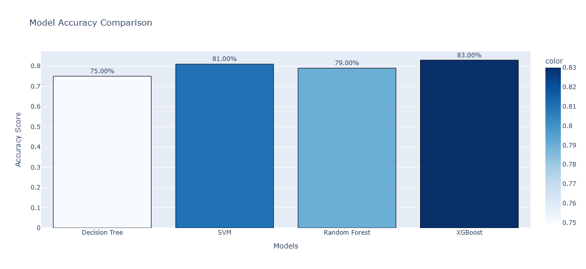
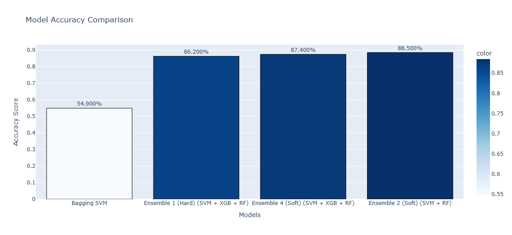

# **Automated Sleep Stage Classification Using Machine Learning**

## **Setup Details**

### **Software and Environment**

* **Platform:** Google Colab  
* **Python Version:** 3.10+  
* **Pip Version:** 23+

### **Required Dependencies:**

* **for data processing and visualization:**numpy, pandas, matplotlib, seaborn   
* **for ML models and feature engineering*:***scikit-learn, sklearn-ensemble  
  * ML Models Used: \-  
    * Decision Tree  
    * Random Forest  
    * Support Vector Machine  
    * XG Boost Classifier  
  * Ensemble Models Used: \-  
    * Stacking Classifier  
    * Voting Classifier  
    * Bagging Clssifier  
* **for EEG signal processing library:**mne-python

## **Dataset**

### **Data Source**

For this task, the **Sleep-EDF dataset** from **Physionet.org** *([https://physionet.org/content/sleep-edfx/1.0.0/](https://physionet.org/content/sleep-edfx/1.0.0/))* is taken and experimented. It consists of whole-night polysomnographic (**PSG**) recordings and **hypnogram annotations**.

### **Data Types**

* **PSG.edf Files:** Contain EEG (from **Fpz-Cz** and **Pz-Oz** electrode locations), EOG, submental chin EMG, and other physiological signals.  
* **Hypnogram Files:** Provide manually scored sleep stages for PSG recordings, including Wake (W), REM (R), N1, N2, N3, and unscored periods.

## **Visual Comparison of Model Performance: \-**

####  **\# Figure 1: Comparison of Accuracy of Simple Models**

#### 

#### **\# Figure 2: Comparison of Accuracy of Ensemble Models**

#### 

## **Model Performance on EEG Data**

### **1\. Ensemble 1 (Hard Voting: SVM \+ XGB \+ RF)**

#### **Reason for Selection:**

* Combines **SVM** (high-dimensional handling), **Random Forest** (overfitting resistance and feature interactions), and **XGBoost** (complex pattern learning).  
* Hard voting relies on majority class predictions, making it **less sensitive to outliers**.

#### **Performance:**

* Achieved **86.2% accuracy**, showing significant improvement through model combination.

### **2\. Ensemble 4 (Soft Voting: SVM \+ XGB \+ RF)**

#### **Reason for Selection:**

* Uses **soft voting**, which averages **predicted probabilities** instead of majority votes.  
* More robust than hard voting as it considers model confidence in predictions.

#### **Performance:**

* Achieved **87.4% accuracy**, outperforming hard voting models.

### **3\. Ensemble 2 (Soft Voting: SVM \+ RF)**

#### **Reason for Selection:**

* Uses **SVM** and **Random Forest**, which complement each other:  
  * **SVM** captures non-linear relationships.  
  * **Random Forest** manages feature interactions and prevents overfitting.  
* Soft voting further improves generalization.

#### **Performance:**

* Achieved **88.5% accuracy**, the **highest among all ensembles**.  
* Shows that **SVM \+ RF can outperform XGBoost-based ensembles**.

## **Ensemble Analysis on EEG Data**

### **1\. Why Ensembles Work Well for EEG Data**

* EEG signals are very noisy and non-linear so difficult for a single model to capture all patterns.  
* Ensemble learning combine different models and their abilities (e.g. **SVM’s hyperplanes, RF’s decision trees, and XGBoost’s gradient boosting**) to create a more accurate classifier.  
* Soft voting ensembles (Ensemble 4 & Ensemble 2\) outperform hard voting ensemble because they consider confidence in predictions of every model involved rather than just taking majority-based decision, which is very important in noisy EEG data.

### **2\. Performance Highlights**

* **Ensemble 1 (Hard Voting):** **Significant improvement** by combining multiple models.  
* **Ensemble 4 (Soft Voting):** **Further improvement** via averaging probabilities.  
* **Ensemble 2 (Soft Voting):** **Highest accuracy (88.5%)**, with the best balance of performance and simplicity.

### **3\. Key Takeaways**

* **Soft voting ensembles** are more suitable for **EEG classification**, as they handle **complex, non-linear relationships** better.  
* **SVM \+ Random Forest ensembles** perform exceptionally well, even without the added complexity of XGBoost. This model can generalize to the dataset of EEG quite well than others

## **Conclusion**

These ensemble models indicate that combination of multiple classifiers can significantly improves automated EEG sleep stage classification. The most accurate model, Ensemble 2 (Soft Voting: SVM \+ RF), reached a precision of 88.5%, a high candidate for applications of real sleep stage classification.
